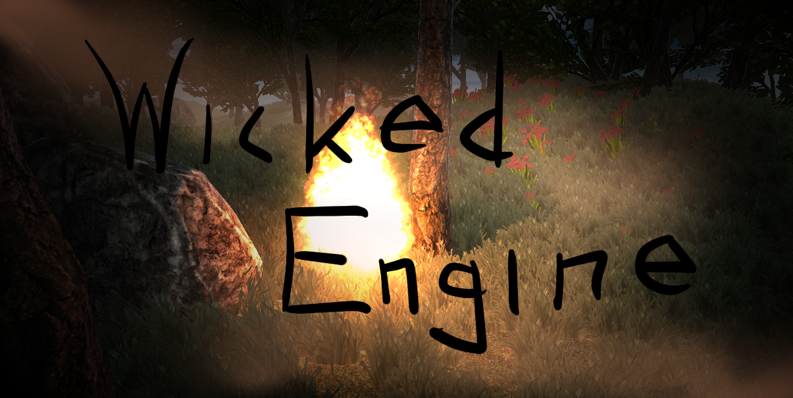

# Wicked Engine
## Created by Turánszki János

### Overview:

Wicked Engine is an open-source game engine written in C++. For list of features, see features.txt.
Demos are available at: https://github.com/turanszkij/WickedEngineDemos
From now on you can easily set up a game project by using the component templates. (see the demos for examples)

Video: https://www.youtube.com/watch?v=nNlfkrURqZQ  
Video of the Editor: https://www.youtube.com/watch?v=iMluDH8oaFg

### Platforms:
- Windows PC Desktop (tested for version 0.9.11)
- Universal Windows (tested for version 0.9.11)

### Requirements:

- Visual Studio 2015+
- Windows SDK
- DirectX11 SDK (included in Windows SDK)(legacy SDK not supported)
- DirectX11 June 2010 Redist (Only if you want to support Windows 7 because it uses Xaudio 2.7!)

### Hardware: 

- DirectX 11+ Graphics card

### Usage: 

Set the following dependencies to this library in Visual Studio this way in the implementing project:

1. Open Project Properties -> Configuration Properties
2. C/C++ -> General -> Additional Include Directories: 
	- ./WickedEngine
3. Linker -> General -> Additional Library Directories:
	- Directory of your built .lib file (Debug or Release directory in the solution by default)

When your project settings are set up, time to #include "WickedEngine.h" in your source. I recommend to include this
in the precompiled header file. This will enable the use of all the engine features and link the necessary binaries.
This will not load all the features for you however. For that, use the helper wiInitializer::InitializeComponents() which 
will load all features of the engine. If you want to use just a subset of features, specify in the parameters of the function
with a WICKEDENGINE_INITIALIZER enum value, or multiple values joined by the | operator.
For further details, please check the demo project at: https://github.com/turanszkij/WickedEngineDemos.

Windows 7 support: define _WIN32_WINNT=0x0601 preprocessor on the whole project

Windows Store support: define WINSTORE_SUPPORT preprocessor for the whole project

### Contents:

- ./WickedEngine.sln 					- Visual Studio Solution; 
- ./WickedEngine/WickedEngine.vcxproj		- Visual Studio Project; 
- ./WickedEngine/BULLET/					- Bullet 2.82 Source files; 
- ./WickedEngine/LUA/					- Lua 5.3.1 Source files; 
- ./WickedEngine/shaders/					- Binary shaders output; 
- ./WickedEngine/ 						- C++ and shader source files; 
- ./WickedEngine/Utility 					- C++ source files for utility helpers;
- ./io_export_wicked_wi_bin.py 			- Blender 2.72+ script to export scene; 

### Scripting API:

You can use a great number of engine features through the Lua scripting api, which can even be used real time while the program is running.
For further details, please check the scripting API documentation: [Wicked Engine Scripting API](ScriptingAPI-Documentation.md)

### Editor:

The editor is now available but also work in progress. Just build the editor project and run it, then you will be presented with a blank scene.
You can import files exported from Blender (.wio) with the scipt described below. You can also save models into the .wimf format from the Editor
and open them.

You can export models from Blender with the provided python script: io_export_wicked_wi_bin.py
Notes on exporting:
- Names should not contain spaces inside Blender
	The problem is the c++ side code which parses the text files such as it breaks parsing on spaces. 
	Mesh files are already exported as binary, so those are okay
	Suggested fix: write binary export for everything
- Separate files generated
	I've written the exporter to write different categories of the scene to different files for easier debugging
	from a text editor. If the exporter is rewritten to write binary for everything, such debugging will
	not be possible so might as well merge the files (except mesh files and error message file)
- Only animation supported is skeletal animation
- Animation Action names should contain their armature's name so that the exporter matches them correctly
	Suggested fix: find a better way of matching armatures and actions
- Animation only with linear curves (so no curves)
	Suggested fix: implement curves support into the engine and the exporter
- Only one uv map support
	Light maps and other effects requiring multiple uv maps are not possible yet.
	

